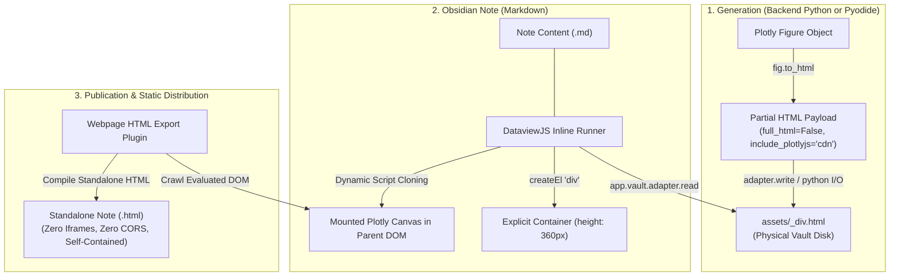

# Interactive Plotly in Obsidian: Automated Asset Injection & Standalone HTML Export Pipeline

**Date:** 2026-10-06  
**Status:** Brainstorm / Architectural Design  
**Origin:** Working Proof-of-Concept in [`wald_hypothesis_testing_quiz_prep.v4.final.md`](file:///c:/Users/theaa/ai-sandbox-master/ai-sandbox/academic-hub/academic_notes/econometrics/summaries/wald_hypothesis_testing_quiz_prep.v4.final.md)  
**Target Systems:** [`agent/viz`](file:///c:/Users/theaa/ai-sandbox-master/ai-sandbox/academic-rag-model/agent/viz/README.md), [`agent/study_guide`](file:///c:/Users/theaa/ai-sandbox-master/ai-sandbox/academic-rag-model/docs/trackers/academic_hub_to_do.md#L169-L170), and Obsidian Vault (`academic-hub`)

---

## 1. Executive Summary & Vision

A major pedagogical superpower of the Academic Hub is rendering abstract theoretical concepts visible and manipulable—for example, animating the convergence of estimators across sample size $n$, visualizing the curvature and tangent approximations of the Wald, Likelihood Ratio, and Lagrange Multiplier "Testing Trinity", or adjusting parameters in microeconomic indifference maps.

While generating interactive Plotly visualizations in Python is straightforward, **embedding interactive visualizations within local Obsidian Markdown notes and reliably exporting the compiled notes as standalone, fully self-contained HTML files** has historically been blocked by four severe architectural constraints:
1. Pyodide in-memory virtual filesystem sandboxing.
2. Headless export callback deadlocks on `<iframe>` or `![[plot.html]]` transclusions.
3. Browser `file:///` local origin security (CORS) blocking embedded iframes.
4. Unbounded container height collapse (`0px`), which corrupts Plotly coordinate systems and MathJax/SVG typography.

In our recent econometrics session, we resolved all four constraints by developing the **Decoupled Asset Injection** pattern. 

The goal of this brainstorm is to formalize this breakthrough into an **automated end-to-end pipeline in `academic-rag-model`**, enabling future study guide generators, summary enhancers, and pedagogical agents to automatically produce, embed, and export interactive data visualizations without manual user glue.

---

## 2. Technical Problem & Bottlenecks Resolved

Embedding client-side dynamic graphics in a local-first Markdown knowledge base presents multiple failure modes across runtime environments:

```
┌────────────────────────────────────────────────────────────────────────────────────────┐
│                                 THE FOUR BOTTLENECKS                                   │
└────────────────────────────────────────────────────────────────────────────────────────┘

 [1. Pyodide Sandbox]          [2. Exporter Deadlock]        [3. file:/// CORS Isolation]      [4. Layout Collapse]
   Writes to /home/pyodide       Waiting for generic           Embedded iframe script            Container height = 0px
   RAM; vault disk is            plugin render callbacks       execution blocked by              causes division-by-zero
   unaware of file.              indefinitely.                 browser origin policy.            and MathJax corruption.
          │                             │                                 │                             │
          ▼                             ▼                                 ▼                             ▼
 ┌─────────────────────────────────────────────────────────────────────────────────────────────────────────────┐
 │                         DECOUPLED ASSET INJECTION ARCHITECTURE                                              │
 └─────────────────────────────────────────────────────────────────────────────────────────────────────────────┘
```

### 2.1. Sandbox Isolation (Pyodide / Python DS Studio)
When running Python code locally within Obsidian via WebAssembly (Pyodide), Python standard I/O writes to an in-memory virtual filesystem (`/home/pyodide`). Calls like `fig.write_html("plot.html")` succeed silently in browser memory but write nothing to the physical vault disk.
* **Resolution:** Bridge through Pyodide's JavaScript interop (`import js`) directly into Obsidian's Electron vault adapter (`js.app.vault.adapter.write(...)`), persisting files directly to physical disk.

### 2.2. Headless Exporter Hangs (`Webpage HTML Export` Plugin)
The community standard export plugin (by Nathan George) traverses the active note DOM to capture evaluated components into standalone static HTML. When notes contain live `<iframe>` tags or native Obsidian HTML transclusions (`![[plot.html]]`), the headless exporter awaits asynchronous iframe initialization and transclusion callbacks that never resolve in the exporter context (`Waiting for generic plugins to render... [220/219]`).
* **Resolution:** Eliminate iframes and transclusion links entirely. Inject the partial HTML DOM directly into the parent note's DOM hierarchy.

### 2.3. Browser Security Sandboxing (`file:///` CORS)
When a user opens an exported HTML note locally via double-click (`file:///path/to/note.html`), modern web browsers enforce strict origin sandboxing: every local file is treated as an opaque, unique origin. If the static page attempts to load another local file via `<iframe src="assets/plot.html">`, the browser halts cross-frame script execution and blocks rendering.
* **Resolution:** Embed the visualization inline within the primary document's DOM. Because it executes within the parent origin, local double-click viewing is 100% functional without requiring a local web server (`localhost`).

### 2.4. Layout Collapses & Glyph Corruption
In Obsidian's live preview and export rendering pipeline, container elements with relative heights (`height: 100%`) frequently collapse to `0px` because parent container dimensions are unset. When Plotly's rendering engine initializes inside a $0 \times 0$ box:
- Coordinate projection matrices suffer division-by-zero errors.
- Global SVG font metrics become garbled.
- MathJax mathematical typesetting and LaTeX glyph rendering across the rest of the document are corrupted.
* **Resolution:** Enforce a strict, explicit pixel geometry on the wrapper container (`style="width: 100%; height: 360px; position: relative;"`).

---

## 3. The Decoupled Asset Injection Architecture



### 3.1. Partial HTML Generation
Instead of serializing a full HTML document (`<!DOCTYPE html><html>...`), the generator outputs **only the chart component** (`full_html=False`):
```python
# full_html=False drops conflicting document wrappers and boilerplate
partial_html = fig.to_html(include_plotlyjs="cdn", full_html=False)
```
This payload consists strictly of an outer `<div>` containing Plotly data and layout configs followed by an inline `<script>` tag invoking `Plotly.newPlot(...)`.

### 3.2. DataviewJS Mounting Block
Standard Markdown parsers sanitize or ignore embedded raw `<script>` tags for security. We leverage **DataviewJS** as a safe, reactive execution environment that reads the asset, provisions an explicit container, and forces browser execution of the embedded scripts:

````markdown
```dataviewjs
// 1. Read the saved partial HTML from vault disk
const path = "econometrics/summaries/assets/testing_trinity_div.html";
const rawHtml = await app.vault.adapter.read(path);

// 2. Create container with explicit fixed pixel height (prevents 0px collapse)
const container = this.container.createEl("div", { 
    attr: { style: "width: 100%; height: 360px; position: relative;" } 
});

// 3. Inject HTML markup
container.innerHTML = rawHtml;

// 4. Force browser evaluation of script tags (innerHTML disables <script> by default)
Array.from(container.querySelectorAll("script")).forEach(oldScript => {
    const newScript = document.createElement("script");
    Array.from(oldScript.attributes).forEach(attr => newScript.setAttribute(attr.name, attr.value));
    newScript.appendChild(document.createTextNode(oldScript.innerHTML));
    oldScript.parentNode.replaceChild(newScript, oldScript);
});
```
````

### 3.3. Export Execution
When the user executes **Webpage HTML Export**:
1. The exporter crawls the already-evaluated DOM tree.
2. The Dataview block is captured in its post-execution state (the live Plotly SVG/WebGL canvas and initialized markup).
3. The resulting exported HTML runs smoothly when double-clicked locally (`file:///`), served via HTTP, or hosted on GitHub Pages.

---

## 4. End-to-End Pipeline Blueprint for `academic-rag-model`

To eliminate manual script pasting and enable autonomous generation of interactive summaries, we design a modular pipeline across `agent/viz`, `agent/study_guide`, and note post-processing.

```
                    ACADEMIC RAG AUTOMATED VISUALIZATION PIPELINE
                    
 ┌──────────────────────┐      ┌─────────────────────────┐      ┌──────────────────────────┐
 │  Course Transcripts  │      │  RAG Tutoring / Summary │      │ Retrieved Math / Physics │
 │   & Lecture Notes    │ ───► │  Agent (Gemini-3.6/3.8) │ ◄─── │ Parameters & Formulas    │
 └──────────────────────┘      └────────────┬────────────┘      └──────────────────────────┘
                                            │
                                  Concept & Parameter Request
                                            │
                                            ▼
                               ┌─────────────────────────┐
                               │  Visualization Agent    │
                               │     (`agent/viz`)       │
                               └────────────┬────────────┘
                                            │
                      ┌─────────────────────┴─────────────────────┐
                      ▼                                           ▼
          [Verified Template]                            [LLM Fallback Generator]
        (`agent/viz/templates/`)                        (`agent/viz/llm_fallback.py`)
                      │                                           │
                      └─────────────────────┬─────────────────────┘
                                            │
                                   Produces Plotly Fig
                                            │
                                            ▼
                           ┌─────────────────────────────────┐
                           │    Vault Asset Emitter Module   │
                           └────────────────┬────────────────┘
                                            │
                   ┌────────────────────────┴────────────────────────┐
                   ▼                                                 ▼
        Partial HTML Artifact                             DataviewJS Embed Snippet
    `assets/<slug>_div.html`                            Injected directly into Note:
  (Written to disk via Python)                        `academic_notes/<course>/...md`
                   │                                                 │
                   └────────────────────────┬────────────────────────┘
                                            │
                                            ▼
                               ┌─────────────────────────┐
                               │   Rendered Obsidian     │
                               │   Interactive Note      │
                               └────────────┬────────────┘
                                            │
                                            ▼
                               ┌─────────────────────────┐
                               │  Static HTML Publishing │
                               │  (Webpage Export / CLI) │
                               └─────────────────────────┘
```

### 4.1. Step 1: Concept & Parameter Extraction (`agent/study_guide` or `rag_agent`)
When generating or enhancing a summary note (e.g., [`wald_hypothesis_testing_quiz_prep.v4.final.md`](file:///c:/Users/theaa/ai-sandbox-master/ai-sandbox/academic-hub/academic_notes/econometrics/summaries/wald_hypothesis_testing_quiz_prep.v4.final.md)), the agent identifies key mathematical concepts that warrant dynamic plots.

Rather than plotting arbitrary toy data, the agent extracts parameterized values from the course materials:
- **Testing Trinity Example:**
  - Objective function: $\ln L(\theta) = -\theta^2$
  - Fisher Information: $\mathcal{I}(\theta) = 2$
  - Restricted parameter: $\tilde{\theta}_r = -4 / \sqrt{n}$
  - Parameter range: $n \in [1, 200]$
  - Distance metrics: Wald $\Delta x$, LR $\Delta y$, LM slope $|m|$.

### 4.2. Step 2: Asset Emitter in `agent/viz` (`vault_emitter.py`)
We extend [`agent/viz`](file:///c:/Users/theaa/ai-sandbox-master/ai-sandbox/academic-rag-model/agent/viz/README.md) with a specialized emitter function tailored for the Obsidian vault structure:

```python
# Proposed: agent/viz/vault_emitter.py

from pathlib import Path
import plotly.graph_objects as go

def emit_obsidian_visualization(
    fig: go.Figure,
    target_note_path: Path,
    slug: str,
    height_px: int = 360,
    include_plotlyjs: str = "cdn",
    generate_static_fallback: bool = True
) -> dict:
    """
    Emits a partial div asset to the note's assets/ directory and returns
    the ready-to-inject DataviewJS snippet.
    """
    # 1. Determine asset directory relative to target note
    note_dir = target_note_path.parent
    assets_dir = note_dir / "assets"
    assets_dir.mkdir(parents=True, exist_ok=True)
    
    div_filename = f"{slug}_div.html"
    div_file_path = assets_dir / div_filename
    
    # 2. Export partial HTML (div + script only)
    partial_html = fig.to_html(include_plotlyjs=include_plotlyjs, full_html=False)
    div_file_path.write_text(partial_html, encoding="utf-8")
    
    # 3. Path relative to vault root (for DataviewJS app.vault.adapter.read)
    # E.g. "econometrics/summaries/assets/testing_trinity_div.html"
    vault_relative_path = div_file_path.relative_to(get_vault_root(target_note_path)).as_posix()
    
    # 4. Optional static image fallback (PNG/SVG) for non-JS / PDF print export
    fallback_rel_path = None
    if generate_static_fallback:
        fallback_filename = f"{slug}_static.png"
        fallback_path = assets_dir / fallback_filename
        try:
            fig.write_image(fallback_path, width=800, height=height_px, scale=2)
            fallback_rel_path = fallback_path.relative_to(get_vault_root(target_note_path)).as_posix()
        except Exception as e:
            # Graceful degradation if Kaleido is not installed
            pass

    # 5. Build standardized DataviewJS snippet
    dataview_snippet = f"""```dataviewjs
// Auto-generated Interactive Plotly Component: {slug}
const path = "{vault_relative_path}";
if (await app.vault.adapter.exists(path)) {{
    const rawHtml = await app.vault.adapter.read(path);
    const container = this.container.createEl("div", {{ 
        attr: {{ style: "width: 100%; height: {height_px}px; position: relative;" }} 
    }});
    container.innerHTML = rawHtml;
    Array.from(container.querySelectorAll("script")).forEach(oldScript => {{
        const newScript = document.createElement("script");
        Array.from(oldScript.attributes).forEach(attr => newScript.setAttribute(attr.name, attr.value));
        newScript.appendChild(document.createTextNode(oldScript.innerHTML));
        oldScript.parentNode.replaceChild(newScript, oldScript);
    }});
}} else {{
    this.container.createEl("p", {{ text: "⚠️ Visualization asset not found: " + path }});
}}
```"""

    return {
        "asset_path": div_file_path,
        "vault_relative_path": vault_relative_path,
        "dataview_snippet": dataview_snippet,
        "fallback_image": fallback_rel_path
    }
```

### 4.3. Step 3: Template Library Additions (`agent/viz/templates`)
The existing template library (`agent/viz/templates/`) contains basic linear algebra and toy math concepts. We should expand it with recurring PhD-level economics models:
1. **`testing_trinity.py`**: Parameterized log-likelihood quadratic approximation, animating $n \to \infty$ with Wald distance, LM tangent, and LR vertical gap.
2. **`utility_maximization.py`**: Indifference curves tangent to budget constraints with income and substitution effect vectors (Slutsky decomposition).
3. **`solow_growth.py`**: Capital accumulation curve $s f(k)$ intersecting depreciation line $(n+g+\delta)k$ with steady-state convergence slider.
4. **`is_lm_ad_as.py`**: Goods market and money market simultaneous equilibrium with fiscal/monetary policy shifts.

### 4.4. Step 4: Automated Injection into Summary Notes
In [`agent/study_guide`](file:///c:/Users/theaa/ai-sandbox-master/ai-sandbox/academic-rag-model/docs/trackers/academic_hub_to_do.md#L169-L170) or [`pipelines/postprocess_notes`](file:///c:/Users/theaa/ai-sandbox-master/ai-sandbox/academic-rag-model/pipelines/postprocess_notes/), when an interactive visualization is generated:
1. The note generator reserves an anchor section:
   ```markdown
   #### 1.4.2 Interactive Geometric Animation
   
   <interactive-viz:testing-trinity>
   ```
2. The pipeline replaces the marker with the compiled DataviewJS snippet and emits the corresponding `.html` asset into `assets/`.
3. The note is immediately viewable in Obsidian and ready for one-click static HTML export.

---

## 5. Potential Enhancements & Superpowers

### 5.1. Headless Batch Exporter CLI
While Obsidian's `Webpage HTML Export` GUI plugin works well for ad-hoc exports, a CLI tool (using Puppeteer or Playwright) could automate static HTML generation across all course summaries during weekly index syncs without needing to launch the Obsidian desktop app.

### 5.2. Plotly Bundle Deduplication
When multiple Plotly charts appear on a single page, each `<div>` calling `include_plotlyjs="cdn"` causes multiple script tags pointing to the same CDN bundle. 
- *Optimization:* A lightweight preamble block in the note or header that loads Plotly once, allowing child components to set `include_plotlyjs=False`.

### 5.3. Dual Modality (LLM Scientific Diagram + Plotly Slider)
As noted in the tracker ([`academic_hub_to_do.md:L170`](file:///c:/Users/theaa/ai-sandbox-master/ai-sandbox/academic-rag-model/docs/trackers/academic_hub_to_do.md#L170)), some concepts require conceptual schematic diagrams (e.g. game trees, DAGs for causal inference) rather than coordinate plots.
- The pipeline can combine **Mermaid / SVG schematic diagrams** for structural relationships alongside **Plotly partial divs** for dynamic numeric parameter spaces.

---

## 6. Actionable Implementation Plan

| Milestone | Deliverables | Assigned Area |
| :--- | :--- | :--- |
| **M1. Core Emitter Module** | Build `agent/viz/vault_emitter.py` with `emit_obsidian_visualization()` supporting partial div output and DataviewJS generation. | `academic-rag-model/agent/viz` |
| **M2. Testing Trinity Template** | Formalize the Testing Trinity Likelihood function into a permanent template at `agent/viz/templates/testing_trinity.py`. | `academic-rag-model/agent/viz/templates` |
| **M3. Study Guide Pipeline Integration** | Add `--visualize-interactive` flag to study guide and summary enhancement workflows to automatically wire up assets. | `academic-rag-model/agent/study_guide` |
| **M4. Validation Suite** | Write unit tests verifying partial div syntax, absence of `<!DOCTYPE>` collisions, container height constraints, and file path resolution. | `academic-rag-model/tests/agent/viz` |

---

## 7. Relevant Workspace References

- **Live Example Note:** [`wald_hypothesis_testing_quiz_prep.v4.final.md`](file:///c:/Users/theaa/ai-sandbox-master/ai-sandbox/academic-hub/academic_notes/econometrics/summaries/wald_hypothesis_testing_quiz_prep.v4.final.md#L148-L168)
- **Live Generated Asset:** [`testing_trinity_div.html`](file:///c:/Users/theaa/ai-sandbox-master/ai-sandbox/academic-hub/academic_notes/econometrics/summaries/assets/testing_trinity_div.html)
- **Testing Scratchpad:** [`testing_html.md`](file:///c:/Users/theaa/ai-sandbox-master/ai-sandbox/academic-hub/academic_notes/econometrics/summaries/testing_html.md#L175-L182)
- **Existing Visualization Sub-Agent:** [`agent/viz/README.md`](file:///c:/Users/theaa/ai-sandbox-master/ai-sandbox/academic-rag-model/agent/viz/README.md)
- **Roadmap Tracker:** [`docs/trackers/academic_hub_to_do.md:L166-L171`](file:///c:/Users/theaa/ai-sandbox-master/ai-sandbox/academic-rag-model/docs/trackers/academic_hub_to_do.md#L166-L171)
